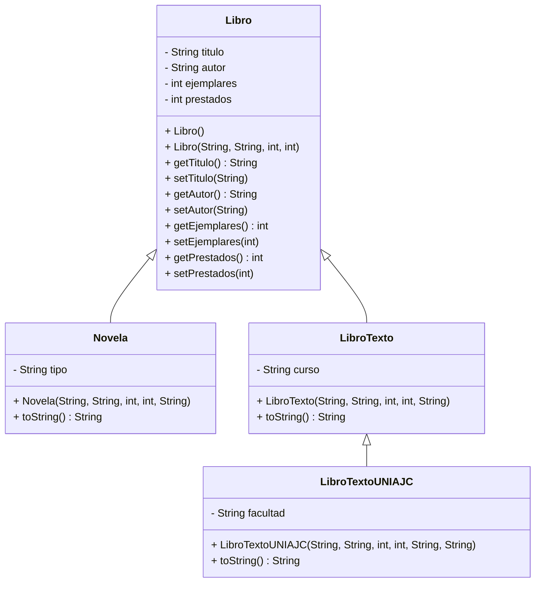

# Parcial I - Programación II
Proyecto de sistema de gestión de biblioteca.
## Diagrama UML

## Casos donde la herencia no sería posible
Clase final: final class Libro {
    String titulo;
}

Problema: class Novela extends Libro {
}. Esto da error porque una clase final no puede ser heredada en Java.

Constructor privado: public class Libro {
    private Libro() {
    }
}

Problema: class LibroTexto extends Libro {
}. Error porque las subclases no pueden acceder a un constructor private.

## Atributos
private int añoPublicacion;
private String editorial;

## Metodo
public int ejemplaresDisponibles() {
    return ejemplares - prestados;
}

Actualización final del proyecto.
